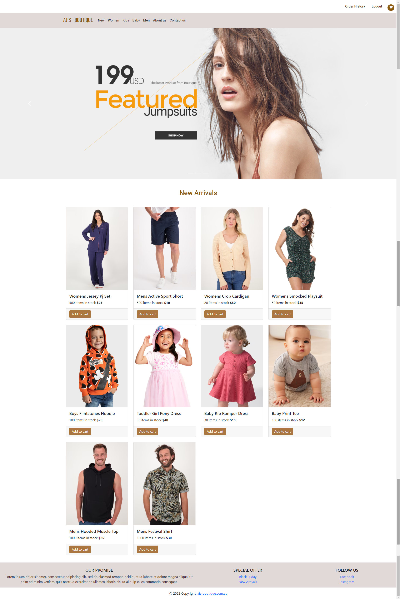

# 23 Final Project: MERN Stack Single-Page Application 
# Project : AJ's - Boutique

This is the final project of the bootcamp. Working individually we were tasked to build a MERN Stack Single-Page Application of our choice. 

We were given the following requirement.

## Project Requirements

Your group will use everything you’ve learned throughout this course to create a MERN stack single-page application that works with real-world data to solve a real-world challenge, with a focus on data and user demand. This project will provide you with the best opportunity to demonstrate your problem-solving skills, which employers will want to see during interviews. Once again, the user story and acceptance criteria will depend on the project that you create, but your project must fulfill the following requirements:

* Use React for the front end.

* Use GraphQL with a Node.js and Express.js server.

* Use MongoDB and the Mongoose ODM for the database.

* Use queries and mutations for retrieving, adding, updating, and deleting data.

* Be deployed using Heroku (with data).

* Have a polished UI.

* Be responsive.

* Be interactive (i.e., accept and respond to user input).

* Include authentication (JWT).

* Protect sensitive API key information on the server.

* Have a clean repository that meets quality coding standards (file structure, naming conventions, best practices for class and id naming conventions, indentation, high-quality comments, etc.).

* Have a high-quality README (with unique name, description, technologies used, screenshot, and link to deployed application).

## Project Link

This project is called as AJ's-Boutique. To view the live webpage, please [click here](https://ajs-boutique-final.herokuapp.com/)

# Table of Contents

- [Installation](#installation)
- [Usage](#usage)
- [Features](#features)
- [License](#license)
- [Contribute](#contribute)

## Installation

After cloning the gihub repo. Navigate to the root folder and enter  

'npm i'
 
this will allow all the npm dependencies to be installed. 

To populate the data enter   
'npm run seed' 

 
The last step to complete installation is to input 'npm run develop' in the root directoy. This allows the 'front end and back end' (server and client folders) to run concurrenty. 
Once this is done a window will automically open displaying the application. 

## Usage

The website allows users to either sign up or login. 
Once logged in they will be able to select various products from following categories: Men, Women, Kids, Baby and New arrivals.
The Website has separate pages for About and Contact.
Logged-in users can see their order history details.
The website uses Stripe payment platform for accepting payments.  

## Features
This application was made up of the following features: 
- apollo-client
- bcrypt
- boostrap
- concurrently 
- dotenv
- express
- graphQL
- JWT-decode
- mongoose
- node.js
- nodemon 
- react
- react-bootstrap
- react-dom
- react-router-dom
- react-scripts

## License

This project is released under the [ISC LICENSE](https://img.shields.io/badge/License-ISC-blue.svg)

## Contribute
If you would like to contribute to this project please contact me via email at ajaycoolkarni@yahoo.com